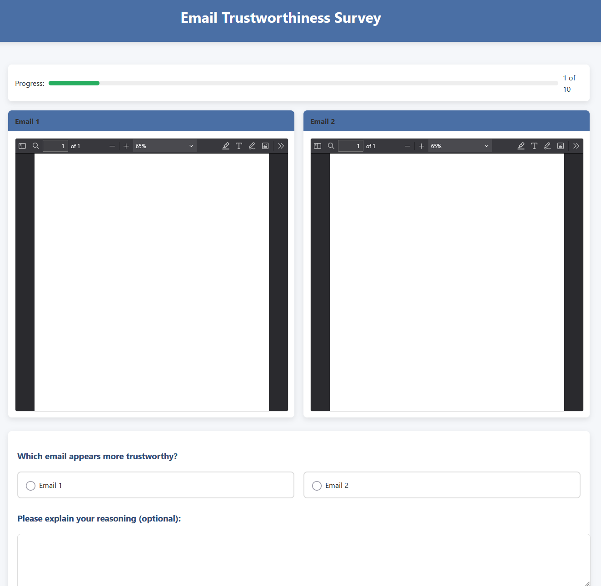

# Email Trustworthiness Survey

A web-based survey application designed to evaluate human perception of email trustworthiness, specifically focusing on phishing emails and the malicious use of AI-generated content.

## Project Overview

This application was developed as part of a bachelor's thesis investigating how AI can be used maliciously in phishing attacks. The survey presents participants with pairs of emails and asks them to select which one appears more trustworthy, collecting data on how people perceive different types of emails.

## Features

- Participant consent and demographic data collection
- Randomized presentation of email pairs for comparison
- Collection of trustworthiness judgments and optional explanations
- Time tracking for decision-making
- Results storage in CSV format

## Requirements

- Python 3.6+
- Flask
- Web browser

## Installation

1. Clone the repository:
   ```bash
   git clone <repository-url>
   cd email-trustworthiness-survey
   ```

2. Install dependencies:
   ```bash
   pip install -r requirements.txt
   ```

3. Set up the email samples:
   - Place email HTML files in an `emails` directory
   - Files should follow the naming convention:
     - `phish_*.html` for phishing emails
     - `ai_*.html` for AI-generated emails
     - `regular_*.html` for legitimate emails

## Usage

1. Start the application:
   ```bash
   python app.py
   ```

2. Access the survey through your web browser at `http://localhost:5000`

3. Survey flow:
   - Consent page
   - Demographics collection
   - Instructions
   - 10 pairs of emails for comparison
   - Thank you page

## Configuration

- Edit `app.py` to modify the number of pairs shown (`NUM_PAIRS`)
- Change the secret key in `app.secret_key` for production use
- Results are stored in `results.csv` in the project root directory

## Data Collection

The application records:
- Unique participant ID
- Timestamp for each selection
- Email pair information (filenames)
- Which email was selected as more trustworthy
- Optional explanations
- Time taken to make each decision

## Research Purpose

This tool is designed to investigate how effectively humans can distinguish between:
- Legitimate emails
- Traditional phishing emails
- AI-generated malicious content

The collected data helps analyze vulnerability patterns and can inform better security awareness training.
